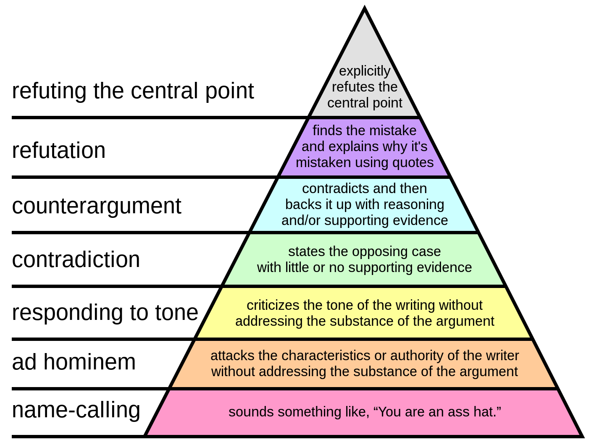
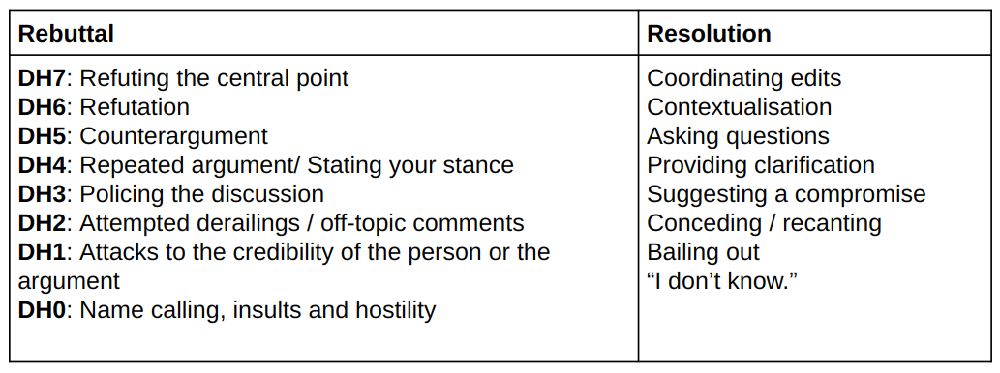

This is a report of a mini-project for visualizing wikipedia conversations on summer 2022.
The data was gathered by Christine De Kock and Andreas Vlachos.
The code was written by me ([Zahra Arjmandi Lari](mailto:z.arjmandi@gmail.com)).
Part of the credit for the ideas on "how to visualize" goes back to [Tom Stafford](https://tomstafford.sites.sheffield.ac.uk/).

# The Story In Short

Each Wikipedia page have a [talk/discussion page](https://en.wikipedia.org/wiki/Help:Talk_pages) where editors discuss how to improve a page.
In some occasions, the editors have different opinions on some topics and the talk page will be tagged as "dispute" by the editors.
In some cases the editors resolve the disputes on their own; in other cases the disputes are "escalated" and needs mediation from Wikipedia staff.
Wikipedia suggests its users to use hierarchy of disagreement, proposed by @graham2008 to resolve disputes constructively.
Christine De Kock and Andreas Vlachos have annotated \~200 conversation from Wikipedia talk pages categorized as "dispute".
They have labeled each part of the conversation (utterance) accordingly which consist of \~4000 utterance [@Christine2022].
Part of the labels are on the basis of Graham's proposed hierarchy of disagreement [see Figure \@ref(fig:grahamhierarchy)] which addresses the "rebuttal tactics".
Graham suggest 7 levels for disagreements starting from name-calling at the bottom (DH0) to refuting the central point (DH7).
The other part of labels are called "resolution tactics" and attempts to promote understanding and consensus.
See Table \@ref(tab:labels).
For more information see @Christine2022.

```{r grahamhierarchy, fig.align = 'center', out.width = "50%", fig.cap = "Graham's hierarchy of disagreement", echo=FALSE}

```

```{r labels, echo=FALSE}
# a work around for using an image instead of a table but using table caption!
temp.df <- data.frame(image="")
temp.mat <- as.matrix(temp.df)
colnames(temp.mat) <- NULL
knitr::kable(temp.mat, caption="Labels used for annotationg Wikipedia Discussion Pages")
```

## Our Question

What we wanted to know was "what is the difference in how conversation flows in"escalated" versus "non-escalated" discussions?"

## What We Did In Summary

I divided data into escalated and non-escalated conversations.
For each utterance, picked one or multiple label(s).
Then, built the transition matrix and visualized the graphs; each label served as a node and the transition probability between each two nodes, became the strength of the edges.
First, we wanted to know whether escalated conversation lack higher order DHs or not.
I drew the graph such that in case of multi-label utterance, the higher label is shown (for more information see [1](#refs)).
Our graphs showed that escalated discussion do have at least the same amount of higher order DHs [see Figure \@ref(fig:maxMethod)]. Then we thought that maybe the higher order DHs are accompanied with lower order DHs in escalated conversations.
Potentially, this could neutralize the effect of using higher order resolution techniques [see Figure \@ref(fig:minMethod)]. Based on the graphs, it seems like in 'escalated' conversations lower order DHs were used more!
In the end, we had the idea of dividing transitions such that each label has the chance to be part of the graph [see Figure \@ref(fig:allMethod)].
It shows that less resolutional tactics were used in 'escalated' conversations, compared to 'non-escalated' ones.
It also shows that 'rebuttal' tactics did not encourage 'resolutional' tactics (such as 'Asking questions' "providing a clarification", or "suggesting a compromise" ) in 'escalated' conversations versus 'non-escalated' ones.
In the next sections, you will find the journey for making those graphs. If you wish to skip this part, you can [jump to the Result's section][Results] for the results and more discussion.

# The Code

## Import libraries.
First, import "reticulate" for running python codes.
Then installing "pyvis" in this python version. "Pyvis" is the library for visualizing graphs.
Then, in python import "numpy" for handling matrices and "json" for handling the raw data file (opening and reading .json format).

```{r results='hide'}
library(reticulate)
library(R3port)
py_install("pyvis==0.3.1")
py_install("pandas")
```

```{python}
#import needed libraries
import numpy as np
import pandas as pd
import json
from itertools import compress
from collections import Counter
from pyvis.network import Network
# also import my own functions
import my_functions as funcs
```

## Data cleaning and wrangling

Next, open the data file and load it. Let's have a look at how data is saved:

```{python}
# Opening JSON file
raw_data = open('frequency_data.json')
  
# returns JSON object as 
# a dictionary
raw_data = json.load(raw_data)

raw_data[0:5]
```

The raw_data is a list containing multiple dictionaries. Each dictionary has two keys:

-   escalation: which shows the type of conversation (either escalated with value 1 or non-escalated with value 0)
-   utt_labels: which shows each utterance's label. Its value is a list of lists containing each utterance label(s). These lists are in the same order that happens in the conversation. To get an idea of the labels' frequency, I built a dictionary containing all the labels and their frequencies:

```{python}
#count frequency of each label in a dictionary
super_dict_labels = {}
for i in range(len(raw_data)):
  dict_list = ([dict(Counter(x)) for x in raw_data[i]['utt_labels']])
  for item in dict_list:
    for k, v in item.items():
      if k in super_dict_labels.keys():
        super_dict_labels[k] += v
      else:
        super_dict_labels[k] = v
super_dict_labels
```

There are multiple labels.
All DH labels are in format of DH[a digit] except for 'DH-1: Bailing out'.
Let's change that:

```{python}
# change label "DH-1: Bailing out" to formal format "DH1: Bailing out"
for conversation in raw_data:
  for labels in conversation['utt_labels']:
    #check if DH- is there
    if "DH-1: Bailing out" in labels:
      idx = labels.index("DH-1: Bailing out")
      labels[idx] = "DH1: Bailing out"


#count frequency of each label in a dictionary after changing DH-1 to DH1

super_dict_labels = {}
for i in range(len(raw_data)):
  dict_list = ([dict(Counter(x)) for x in raw_data[i]['utt_labels']])
  for item in dict_list:
    for k, v in item.items():
      if k in super_dict_labels.keys():
        super_dict_labels[k] += v
      else:
        super_dict_labels[k] = v
# put the list of labels into labels_long variable
labels_long = list(super_dict_labels.keys())
#add 'end' label to the list of labels
labels_long.append('end')
# view long labels
print(labels_long)
```

Explore the stats a bit:

```{python collapse = TRUE}
#count the frequency of multi-label utterances
# keep length of the conversations in two separate lists
# number of utterances
no_utter = 0
no_multi_label = 0
no_esc = 0
no_non_esc = 0
len_esc = []
len_non_esc = []

for conversation in raw_data:
  if conversation['escalation'] == 0:
    no_non_esc += 1
    len_esc.append(len(conversation['utt_labels']))
  else:
    no_esc += 1
    len_non_esc.append(len(conversation['utt_labels']))
  for utterance in conversation['utt_labels']:
    no_utter += 1

    if len(utterance) > 1:
      no_multi_label += 1


print(F"Number of utterances: {no_utter}")
print(F"Number of multi-label utternaces: {no_multi_label}")
print(F"Frequency of multi-label utterances: {no_multi_label/no_utter:.2f}")
print(F"Number of escalated converasation: {no_esc}")
print(F"Number of non-escalated converasation: {no_non_esc}")

# get insight on length of conversations
print(F"Average number of utterance in escalated conversations: {np.around(np.array(len_esc).mean())}")
print(F"Average number of utterances in non-escalated conversations: {np.around(np.array(len_non_esc).mean())}")
print(F"Median length of utterance in escalated conversations: {np.around(np.median(np.array(len_esc)))}")
print(F"Median length of utterances in non-escalated conversations: {np.around(np.median(np.array(len_non_esc)))}")
print(F"Minimum number of utterances in a conversation: {(np.array(len_esc + len_non_esc)).min()}")
print(F"Maximum number of utterances in a conversation: {(np.array(len_esc + len_non_esc)).max()}")
```

\~25% of the utterances are multi-labeled.
To build a transition matrix, I needed to simplify the multi-label utterances.
The 'pick_label' function gets the list of labels and the method, and outputs the final label(s).
I needed to either reduce multi-labels to one label or distribute the transition from i to i+1 th utterance between all the labels; such that each set of label is counted equally.
With that said, the function 'pick_label' accepts three methods:

-   all: the output will be the same as the input.
    It gives back all the labels

-   max: if the labels contain a DH label, the output will be the highest DH.
    Otherwise, the output is the label with the highest frequency

-   min: if the labels contain a DH label, the output will be the lowest DH.
    Otherwise, the output is the label with the highest frequency

Weight of the edge between two nodes in case of using 'all' method:

```{=tex}
\begin{align}
\frac{1}{\text{(no of labels in ith utterance)} \text{(no labels in (i+1)th utterance)}}
\end{align}
```


Let's have a short version of the long labels. Later, I will use short labels for node identification in the graph.

```{python}
#short labels
labels_short = ['Coords',
 'Context',
 'clarify',
 'DH5',
 'DH4:Repeat',
 'Suggest',
 'DH1:Ad',
 'DH4:stance',
 'Other',
 'DH0',
 'DH3',
 'Ask',
 'Conced',
 'DH6',
 'DH2',
 'DH1:Bail',
 'DH7',
 "Don't know",
 'Other:Quote',
 'DH5:arg with',
 "DH6:with evid",
 'DH1:Attack',
 'DH4:without evid',
 'DH2:off',
 'end']
# make a joint data structure for short and long labels to handle and filter easier
labels_joint = [(short, long) for (short, long) in zip(labels_short, labels_long)]
```
Multiple categories of the same DH are among labels. Since we need to simplify the most, I merged them!
But first, we need to build the transition matrices based on the raw_data.
Each matrix contains all the labels plus a label called 'end'.
The last list in each 'utter_label' is followed by 'end' (or end of the conversation).
Here, we can change the method of extracting labels in 'pick_label' function by changing 'method' variable.
The data will be stored in a dictionary with each method as a key, and the values are another dict with keys as escalated and non-escalated types and values equal to an empty dataframe. The dataframe rows and columns are the short labels.

```{python}

# create empty dataframe with rows and columns labeled by 
# short labels and size equal to any empty transition matrix
transition_mtx = np.zeros((len(labels_short), len(labels_short)), float)

df = pd.DataFrame(data=transition_mtx,
                  columns=labels_short,
                  index=labels_short)

#methods to be applied
methods = ['all', 'max', 'min']
conversation_type = ['non-esc', 'esc']

transition_dict = {}
for method in methods:
    transition_dict[method] = {}
    for c_type in conversation_type:
        transition_dict[method][c_type] = df.copy()

# fill out the transition matrices
for conversation in raw_data:
  # used index because we need to access to the next utterance 
  # in the same for loop
  for idx_utter in range(len(conversation['utt_labels'])):

    #loop through methods
    for method in methods:
      # find from and to labels
      from_labels = funcs.pick_label(conversation['utt_labels'][idx_utter], super_dict_labels, method)
      len_from = len(from_labels)

      # two for loops in case we wanted to handle more than 1 label:
      for from_label in from_labels:
        #find the short form of the label
        from_label = funcs.long_ver_to_short_label(from_label, labels_joint)

        if idx_utter == len(conversation['utt_labels'])-1:
          #if it's the last part of conversation the to_label is 'end'
          to_labels = ['end']
          
        else:
          to_labels = funcs.pick_label(conversation['utt_labels'][idx_utter+1], super_dict_labels, method)
        
        len_to = len(to_labels)
        for to_label in to_labels:
          #find the short form of the label
          to_label = funcs.long_ver_to_short_label(to_label, labels_joint)
          transition_dict[method][conversation_type[conversation['escalation']]].loc[from_label,to_label] += \
            1/(len_from*len_to)
```


Then, I updated the list of the labels to remove duplicate DHs. 

```{python}

# sum instances of similar DHs and put them into the first instance and rename it
rep_DHs = ['DH1', 'DH2', 'DH4', 'DH5', 'DH6']
to_be_removed = []
to_be_renamed = []
for DH in rep_DHs:
  
  #find DH instances
  DH_x_instances = [inst for inst in labels_short if inst.startswith(DH)]
  to_be_renamed.append(DH_x_instances[0])
  to_be_removed.extend(DH_x_instances[1:])
  # update the matrix by summing all instances into the first instance
  for method in methods:
    for c_type in conversation_type:
      transition_dict[method][c_type][DH_x_instances[0]], \
      transition_dict[method][c_type].loc[DH_x_instances[0]] = \
        transition_dict[method][c_type][DH_x_instances].sum(axis=1), \
        transition_dict[method][c_type].loc[DH_x_instances].sum()
      # rename the summed col and index
      transition_dict[method][c_type]. \
        rename(columns={DH_x_instances[0]:DH},
              index={DH_x_instances[0]:DH},
              inplace=True)
      # remove unwanted rows and cols
      transition_dict[method][c_type].drop(DH_x_instances[1:],
                                        axis=0,
                                        inplace=True)
      transition_dict[method][c_type].drop(DH_x_instances[1:],
                                        axis=1,
                                        inplace=True)
# update list of lables

# keep to be removed idx
to_be_removed_idx = []
for idx, short in enumerate(labels_short):
  # rename the first instance
  if short in to_be_renamed:
    # del labels_joint[idx]
    to_be_removed_idx.append(idx)
    labels_joint.append((short[:3], short[:3]))
  # remove other instances
  if short in to_be_removed:
    # del labels_joint[idx]
    to_be_removed_idx.append(idx)

# sort in reverse so it doesn't get messed up
for idx in sorted(to_be_removed_idx, reverse=True):
  del labels_joint[idx]

```

Let's see the total number of transitions in each converations type (escalated and non-escalated conversations)

```{python}
np.sum(np.sum(transition_dict[method][c_type], axis=0), axis=0)
```

We have \~2000 transition in each method/conversation.
To simplify, I merged labels with low inward transitions (because label 'end' does not have any outward transition).
I summed over each column over both conversation types (we wanted to keep similar labels for both type of conversation to compare).
After filtering, I summed all the filtered labels into label 'Other'. Checkout "update_transition_matrices" function here [ref to the functions]. 

```{python}
#filter the columns with less than a threshold of the inward transitions
threshold_in = 40 # overall 4000 transitions. 40 is one percent

threshold_in = 40
# update transition_dict
for method in methods:
  transition_dict[method] = \
    funcs.update_transition_matrices(transition_dict[method], threshold_in, conversation_type)
```
## graph for filtered transitions and fixed nodes

For the visualizing nodes, we wanted to divide the graph into two parts.
A part for DH labels which are ordered based on their level.
The other part would be all other labels.
It will get done using function divide_labels_and_sort; then I used a function called generate_node_coordinates to map each node to the space and finally those mentioned functions are used inside plot_network to get plotted. If you want to see how those functions work, check them out here [ref to functions].

I added a variable 'threshold' to omit the edges with low number of transitions. If any edge transition is lower than the 'threshold' the edge won't be shown in the graph. I also have removed the transitions from an edge to itself. It helped de-clutter the graph substantially. Besides, the transition from a node to itself means the conversation remained in a state for a longer time (which we did not care about).

The graphs are saved as 'html' files in the current directory (you can find them under the names "non-esc_[method].html" and "esc_[method].html" here [ref to the folder on github]).

```{python}
for method in methods:
  for c_type in conversation_type:
    network = funcs.plot_network(transition_dict[method][c_type], c_type)
    network.save_graph(c_type + "_" + method + ".html")
```
# Results
Since the output graphs are in html and I can only show one html file in this document, I have transformed them into png files.

```{r maxMethod, fig.align = 'center', out.width = "50%", fig.show='hold', fig.cap = "Max method; 'escalated' graph on the left, 'non-escalated' graph on the right"}
knitr::include_graphics(c("esc_max.png", "non-esc_max.png"))
```

Notice how both "escalated" and "non-escalated" conversations use many high-order arguments.
Besides, "non-escalated" discussion are more associated with transitions between arguments and coordinating moves.

Now let's look at the graphs with 'min' method to see if low-order arguments were more present in "escalated" conversations.

```{r minMethod, fig.align = 'center', out.width = "50%", fig.show='hold', fig.cap = "Min method; 'escalated' graph on the left, 'non-escalated' graph on the right"}
knitr::include_graphics(c("esc_min.png", "non-esc_min.png"))
```

It seems like lower order DHs were actually used more in "escalated" conversations.
This means that although higher order DHs were used in "escalated" as much as "non-escalated" conversation, but these higher DHs were accompanied by lower DHs (especially DH1); this could be part of the reason why less coordination was seen.

Given both sets of graphs, we had the idea of giving all the labels equal opportunities to be seen; we built the graphs with "all" method.
```{r allMethod, fig.align = 'center', out.width = "50%", fig.show='hold', fig.cap = "All method; 'escalated' graph on the left, 'non-escalated' graph on the right"}
knitr::include_graphics(c("esc_all.png", "non-esc_all.png"))
```

Comparing the left and right parts of the graphs in "escalated" and "non-escalated" conversation, using "all" labels shows less transitions between the left part (rebuttal tactics) and right part (resolutional tactics) in the "escalated" graph.
This means that although authors in escalated conversations used almost the same level of reasoning to discuss their points of view, but it did not encourage using more resolutional arguments such as "Asking questions", "providing a clarification", or "suggesting a compromise".
See [here](wiki_graph_cambridge.pdf) if you would like to see all the graphs side by side.
They are also available in "html" format on the [project's repository](https://github.com/zahra-arjm/wikipedia_discussions/tree/main/docs).

<<<<<<< HEAD
One sample to show how the graph look like in "html" format; you can zoom on the graph or move the nodes:
=======

One sample to show how the graph look like in html format; you can zoom on the graph or move the nodes to get a better view:
>>>>>>> 2a158f9399d4c29c7e50f45167a6e3a003990928

````{=html}
```{r results='asis'}
xfun::file_string('esc_all.html')
```
````

# Acknowledgments

This work has been supported by EPSRC grant EP/T024666/1: "Opening Up Minds" and the University of Sheffield and the University of Cambridge.

# References

::: {#refs}
:::
